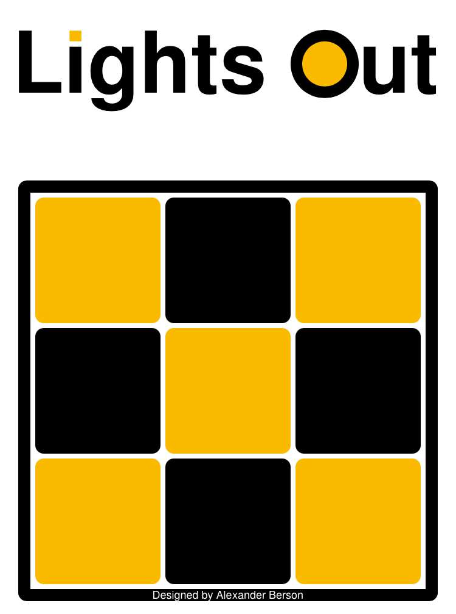

# Lights Out

Turn off all the lights.   
You can [play Lights Out online](https://alex-berson.github.io/lights-out/) or  

## Description

**Lights Out** is an electronic game consisting of a grid of lights. When the game starts, a random number of these lights are switched on. Pressing any of the lights will toggle it and the adjacent lights. The goal of the puzzle is to switch all the lights off.

## Screenshot

  

## License

Copyright &copy; 2025 Alexander Berson. This project is licensed under the [MIT license](LICENSE.txt "MIT License").